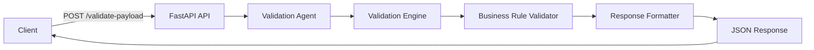
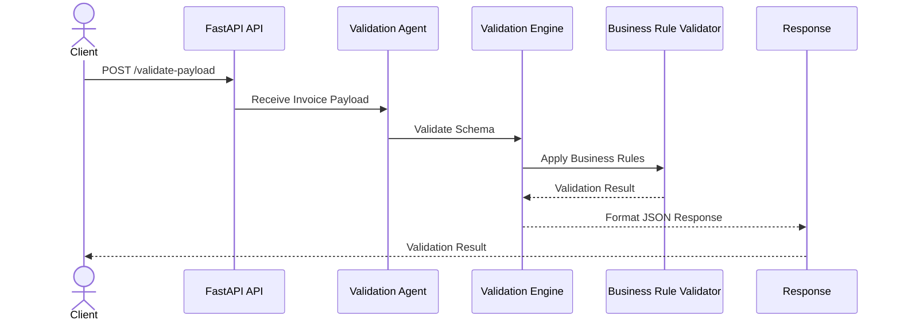
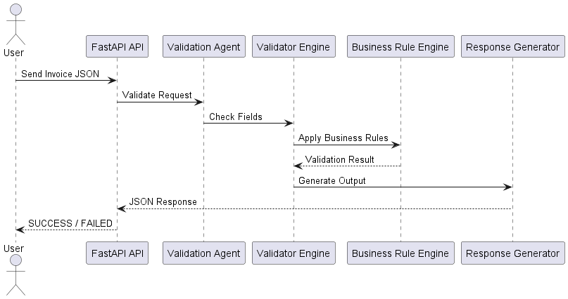

# 🚀 Validation Business Agent


Enterprise-ready Validation Business Agent built using **Python**, **FastAPI**, and a modular **Business Validation Engine**. This application validates invoice payloads using schema validation and business rules, returning structured JSON responses for enterprise workflows.

---

# 📖 Project Overview

Validation Business Agent is designed to validate structured invoice data before downstream processing. It performs schema validation, applies business rules, and returns standardized validation results that can be integrated into enterprise systems.

---

# ✨ Features

- ✅ Invoice Payload Validation
- ✅ Schema Validation
- ✅ Business Rule Validation
- ✅ Modular Validation Engine
- ✅ REST API using FastAPI
- ✅ Standardized JSON Responses
- ✅ Error & Warning Classification
- ✅ Swagger API Documentation
- ✅ Enterprise-ready Architecture
- ✅ Comprehensive Test Coverage

---

# 🛠️ Tech Stack

| Technology | Purpose |
|------------|----------|
| Python 3.11 | Backend Development |
| FastAPI | REST API Framework |
| Uvicorn | ASGI Server |
| Pytest | Testing Framework |
| JSON | Data Exchange |
| PlantUML | Architecture Diagram |

---

# 🏗️ System Architecture



---

# 📂 Project Structure

```text
Validation_BusinessAgent/
│
├── src/
│   ├── main.py
│   ├── business_agent.py
│   ├── validation_engine.py
│   └── utils.py
│
├── docs/
├── tests/
├── out/
│   └── diagram/
│       └── diagram.png
│
├── requirements.txt
├── README.md
└── .gitignore
```

---

# ⚙️ Installation

```bash
git clone https://github.com/kishore8438r-eng/Validation_BusinessAgent.git

cd Validation_BusinessAgent

python -m venv .venv

# Windows
.venv\Scripts\activate

# Linux / macOS
source .venv/bin/activate

pip install -r requirements.txt
```

---

# ▶️ Run the Application

```bash
uvicorn src.main:app --reload
```

Application URL

```
http://127.0.0.1:8000
```

Swagger Documentation

```
http://127.0.0.1:8000/docs
```

---

# 🔄 Validation Workflow



---

# 📥 Sample Request

```json
{
  "invoice_id": "INV-1001",
  "customer_name": "ABC Pvt Ltd",
  "amount": 2500,
  "currency": "USD"
}
```

---

# 📤 Sample Response

```json
{
  "validation_status": "SUCCESS",
  "is_valid": true,
  "errors": [],
  "warnings": []
}
```

---

# 📊 Architecture Diagram



---

# 🧪 Testing

Run all tests:

```bash
pytest
```

Coverage:

```bash
coverage run -m pytest
coverage report
```

---

# 🔮 Future Enhancements

- AI-assisted validation
- Batch processing
- Authentication & Authorization
- Dashboard & Analytics
- Cloud Deployment
- CI/CD Integration

---

# 👨‍💻 Author

**Kishore**

BCA Student | AI & Machine Learning Enthusiast | Python & FastAPI Developer

---

⭐ If you like this project, don't forget to star the repository.